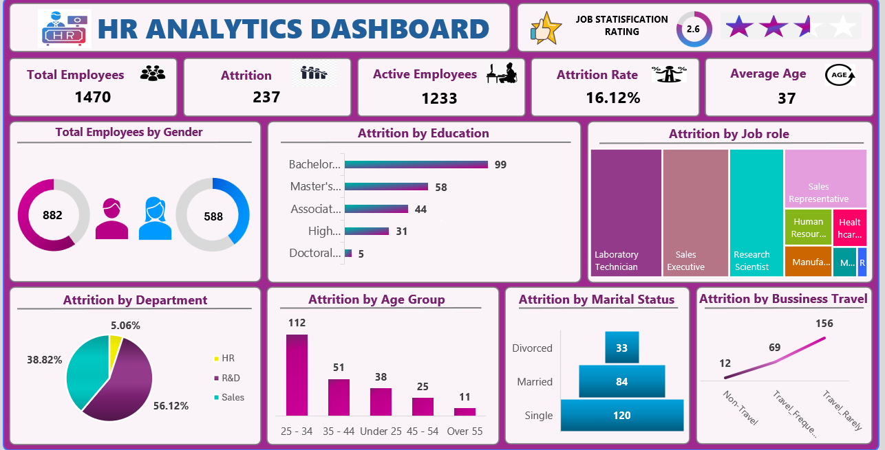

# HR_Analytics_Dashboard
The HR Analytics Dashboard is an interactive data visualization project designed to analyze employee attrition, workforce demographics, job satisfaction, and organizational trends. The dashboard provides meaningful insights that help HR teams improve employee retention and workforce management.

## 📸 Dashboard Preview

